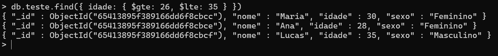

# Criando NoSQL-MongoDB (V.5.0.22)

1 - Crie uma pasta no diretório C:\ chamada de "data" e dentro dela outra chamada "db", caminho completo: c:\data\db.

2 - Após instalado abra um prompt de comando e digite os comandos: "cd C:\Program Files\MongoDB\Server\5.0\bin" e "mongod --dbpath c:\data\db" e aguarde sua execução.

3 - Digite o comnando: "mongo" para entrar dentro do prompt do próprio mongo.

4 - Digite "" para ver os bancos cadastrados.

## Criando ou excluindo bancos
#### Dica: utilize o comando "show databases" para verificar o progresso.

5 - Dentro do prompt do banco, use o comando: "use teste" para criar um banco de dados teste, automaticamente ele irá mudar para este banco. 
#### OBS: Se não houver um banco chamado de teste ele irá cirar um novo e ainda assim ele não criará esse banco, a menos que tenha uma coleção dentro dele, então, vamos criar uma.

6 - Para criar uma coleção digite: "db.colecao_teste.insertOne({ chave1: "valor1", })" e use o comando "show collections" para verificar se tudo ocorreu bem.

7 - Agora que o banco "teste" foi criado com sucesso, garanta que voce está no banco certo para exclui-lo, digite "use teste" e depois "db.dropDatabase()"

## Pesquisando e filtrando coleções
#### Dica: Use o comando ".pretty()" no final de cada comando para ter uma visualização melhor da pesquisa.

8 - Para pesquisar e/ou filtrar coleções vamos tomar como exemplo este comando: "db.teste.insertMany([
  {
    nome: "João",
    idade: 25,
    sexo: "Masculino"
  },
  {
    nome: "Maria",
    idade: 30,
    sexo: "Feminino"
  },
  {
    nome: "Pedro",
    idade: 22,
    sexo: "Masculino"
  },
  {
    nome: "Ana",
    idade: 28,
    sexo: "Feminino"
  },
  {
    nome: "Lucas",
    idade: 35,
    sexo: "Masculino"
  }

])"

9 - Para pesquisar todos utilize "db.teste.find()".

10 - Podemos pesquisar com um filtro "maior que" usando: "db.teste.find({ idade: { $gt: 29 } })".  ( 'gt' refere-se a: greater than.  'lt' seria: less than, para pesquisar valores "menores que")

11 - Para buscarmos valores "entre" podemos usar: "db.teste.find({ idade: { $gte: 26, $lte: 35 } })".

12 - Também podemos pesquisar por sexo utilizando "db.teste.find({ sexo: "Masculino" })".

13 - Se quisermos resgatar apenas os 3 primeiros objetos utilizaremos o comando: "db.teste.find().limit(3)".

## Relações (Aggregate)

O comando Aggregate serve como um "join".

14 - Para usar o comando Aggregate, teremos que criar uma nova coleção com algum tipo de relação entre as tabelas. Para isso utilize o comando: "
db.pedidos.insertMany([
  {
  nome: "João",
    produto: "Camiseta",
    quantidade: 2
  },
  {
    nome: "Maria",
    produto: "Calça",
    quantidade: 1
  },
  {
    nome: "Pedro",
    produto: "Tênis",
    quantidade: 3
  },
  {
    nome: "João",
    produto: "Boné",
    quantidade: 1
  },
  {
    nome: "Ana",
    produto: "Bolsa",
    quantidade: 2
  }
])"

15 - Com a nova coleção criada, podemos utilizar o comando Aggragate em teste: "
db.teste.aggregate([
   {
      $lookup:
         {
           from: "pedidos",
           localField: "nome",
           foreignField: "nome",
           as: "pedidos"
         }
   }
]).pretty()

#### Observe que o resultado da operação são os pedidos de cada pessoa fazendo referencia ao nome dela. Uma breve explicação do comando:
- from: Refere-se a coleção com a qual voce deseja realizar a junção;
- localfield: É o campo, na coleção atual (teste), usado como referencia;
- foreingField: É o campo da coleção da qual você se refere no campo "from";
- as: É o nome do novo campo (alias) que aparecerá na consulta. Neste caso, perceba que o retorno foi a própria coleção "teste" adicionada do campo "pedidos"

